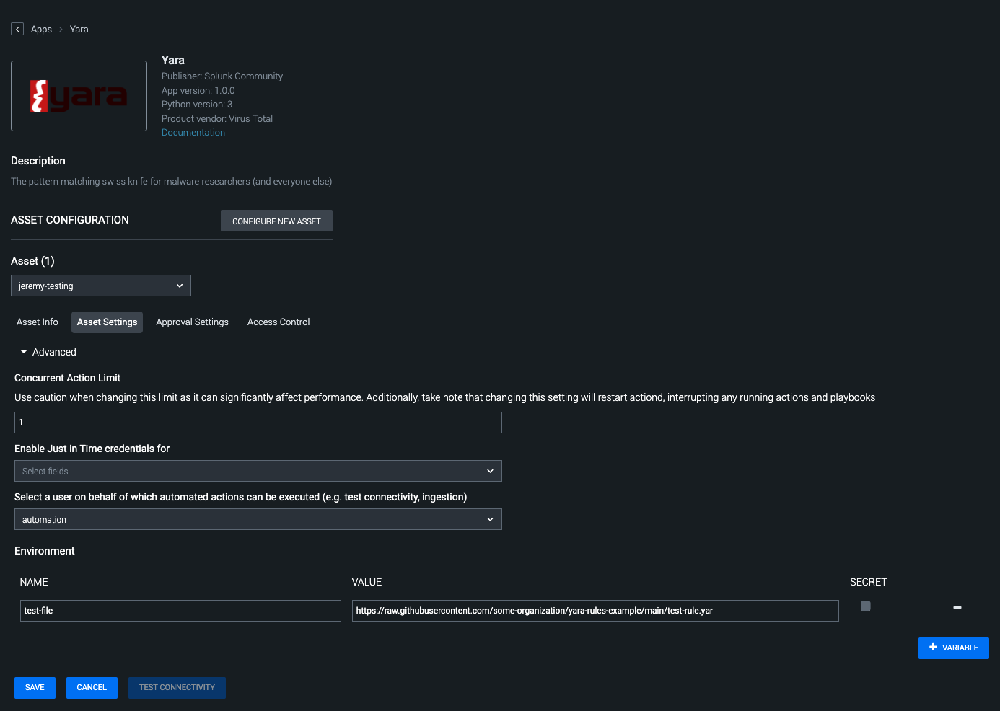

[comment]: # "File: README.md"
[comment]: # "Copyright (c) 2023 Splunk Inc."
[comment]: # ""
[comment]: # "Licensed under the Apache License, Version 2.0 (the 'License');"
[comment]: # "you may not use this file except in compliance with the License."
[comment]: # "You may obtain a copy of the License at"
[comment]: # ""
[comment]: # "    http://www.apache.org/licenses/LICENSE-2.0"
[comment]: # ""
[comment]: # "Unless required by applicable law or agreed to in writing, software distributed under"
[comment]: # "the License is distributed on an 'AS IS' BASIS, WITHOUT WARRANTIES OR CONDITIONS OF ANY KIND,"
[comment]: # "either express or implied. See the License for the specific language governing permissions"
[comment]: # "and limitations under the License."
[comment]: # ""
## [Yara Python](https://yara.readthedocs.io/en/stable/)

### Actions Configured

-   test connectivity
-   update yara sources
-   list yara sources
-   clear yara sources
-   yara scan

#### update yara sources

**Requires a configured asset with 1 or more Environment Variables set to be a list of sources to
download.**  
  
This will iterate over all sources configured in an asset and explode any .zip or individual files
into the applications's state directory. The files here can be listed or loaded for a scan later,
allowing one asset to be built with many sources of Yara rules, possibly serving many use cases.  
  

#### list yara sources

  
  
This will list any items found with the provided file glob for path, if provided. If not provided,
it will default to a file glob of \*, listing everything in the application's state directory
(one-level deep). Also, if checked, "stat info" will provide detailed information about each file
found as returned by
[os.stat_result](https://docs.python.org/3/library/pathlib.html#pathlib.Path.stat)  
  
For reference, [Python's pathlib.Path.glob documentation can show some
examples.](https://docs.python.org/3/library/pathlib.html#pathlib.Path.glob)

#### clear yara sources

  
  
This will clear any files in the state directory that do not end with "state.json". If provided, the
"path" parameter will be used to further limit the clearing to a sub-directory of the asset's
downloaded files.

#### yara scan

  
  
This will load any Yara rules found at "yara path", defaulting to "\*\*/\*.yar" if not provided.
Those loaded rules are compiled and saved for use later, cached at a new file in the state
directory. If that cache cannot be found or read, the rules are compiled and loaded again. The scan
will look for "scan dir" first, falling back to reading the file found at the provided "vault id".
**One of "vault id" or "scan dir" must be provided!**  
  
If specified, "use_includes" can be set to allow your rules to include other rules. Similarly, Yara
rule time out can be overridden along with runtime configuration for Yara like "stack size", "max
strings per rule" and "max match data". For reference to these settings, see [The documentation here
for yara-python](https://yara.readthedocs.io/en/stable/yarapython.html#using-yara-from-python)
